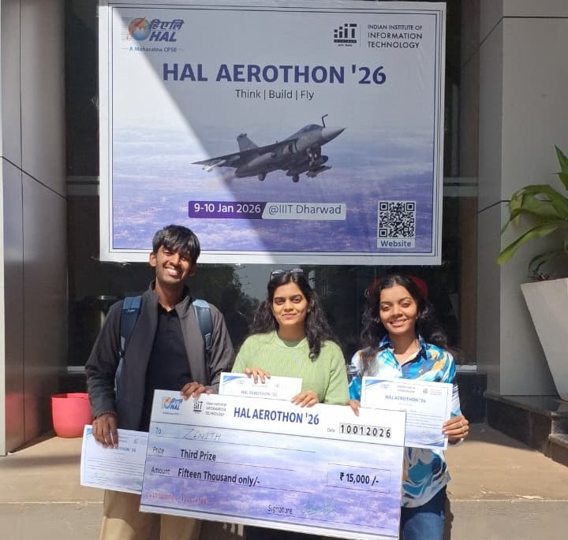
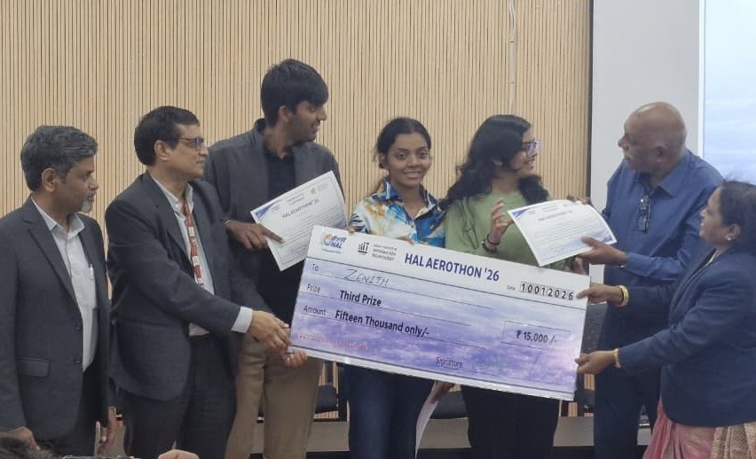
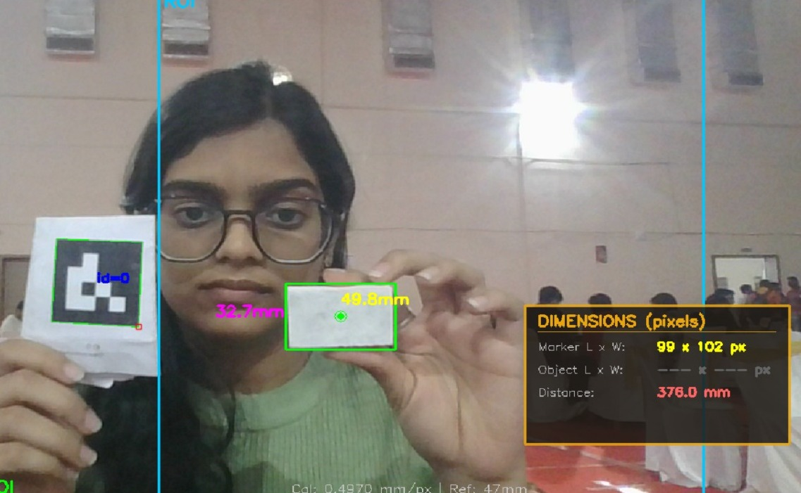
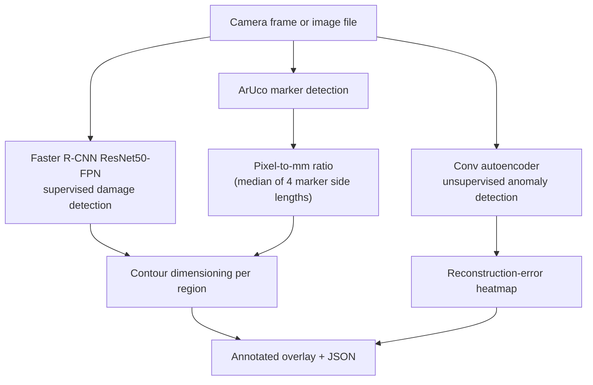
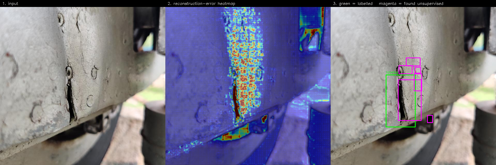

<div align="center">

# INSPECT-AR

**From Manual Inspection to AI Inspector**

Computer-vision inspection for aircraft surfaces — measure a part in millimetres
from a single camera, and find damage on it.

🥉 **Third Prize — HAL AEROTHON '26**
National-Level Aerospace Innovation Hackathon
Hindustan Aeronautics Limited × IIIT Dharwad · 9–10 January 2026




</div>

---

## What this is

Point a camera at an aircraft panel with a **printed ArUco marker** beside it —
a square black-and-white pattern, like a QR code, whose real-world size you
already know. Because the software knows the marker is (say) 47 mm wide and can
see that it occupies 99 pixels, it derives a scale of millimetres-per-pixel and
can then measure anything else in the frame.

On top of that scale sit two independent damage detectors, which answer
different questions:

- A **supervised** detector, trained on labelled aircraft damage, that names
  what it finds — crack, dent, missing head, paint-off, scratch.
- An **unsupervised** autoencoder, trained only on undamaged skin, that flags
  anything unlike normal surface — including damage nobody ever labelled.

Built in 24 hours at HAL AEROTHON '26 by Team Zenith, and developed since.



*The live application. The marker at left is 47 mm wide and occupies 99 px,
giving a scale of 0.4970 mm/px — shown along the bottom edge. The card is then
measured at 49.8 x 32.7 mm without ever touching it.*

---

## Status of each component

Measured on this machine, not estimated. Every number below is reproducible
with the commands in [Running](#running).

| Component | State | Notes |
|---|---|---|
| ArUco calibration (px → mm) | **Working** | 0.14% error against a synthetic ground-truth marker |
| Standalone measurement app | **Working** | Real-time overlay; needs a webcam and a printed marker |
| Faster R-CNN damage detector | **Working** | Real trained weights; localises well, class labels are unreliable — see [Results](#results) |
| Anomaly autoencoder + heatmap | **Working** | Unsupervised; defect regions score 1.7× clean skin |
| Integrated pipeline | **Working** | ~1.8–2.0 s per 640×640 frame, CPU-only |
| HTTP API | **Working** | 5 endpoints, `backend/app.py` |
| Dimension measurement | **Working** | Polarity-aware thresholding: 0.3% / 0.6% error on both dark-on-light and bright-on-dark |
| BLIP captioning | **Working** | Needs ~2 GB free RAM; skips itself cleanly below that. Captions are generic — the model is not fine-tuned on damage |
| VGG16 classifier | **Legacy, off by default** | No trained Keras checkpoint exists anywhere in the project |
| YOLOv8 | **Off by default** | Ships stock COCO weights, which have no damage classes |

---

## Architecture



The scale in **C** is derived purely from the marker's side lengths in the
image. It never needs the camera's intrinsic parameters, which is why it is the
most reliable number this project produces.

The standalone app additionally applies a tilt correction derived from
`solvePnP` pose estimation. That path *does* use camera intrinsics, and those
are **placeholder values** (fx = fy = 800), so distance and orientation readings
are approximate until you substitute a real calibration for your camera.

---

## Results

### ArUco calibration

| Measurement | Value |
|---|---|
| Calibration error | **0.14%** (synthetic 100 px marker declared 50 mm) |
| Dimension accuracy, bright-on-dark | **149.5 × 79.5 mm** against a 150 × 80 mm truth (0.3% / 0.6%) |

### Supervised detector

Faster R-CNN ResNet50-FPN, 8-class head, trained for 23 epochs on two
concatenated Roboflow exports — 5,672 images, 6,219 boxes.

**Read this before trusting its labels.** The checkpoint records `f1 = 0.642`,
but that figure was computed *class-agnostically* — the training script matched
boxes by IoU and never compared predicted labels to ground-truth labels.
Re-running that same evaluation code against the saved weights does not
reproduce it. Two further issues are real and worth stating:

- **Class 1 is a collision.** The two source datasets were concatenated without
  remapping category IDs, so class 1 mixes one dataset's generic "defect" with
  the other's "crack". It is reported as `crack_or_defect` for that reason.
- **Classes 6 and 7 were never trained** — no annotation in either dataset
  carries those IDs — yet they still fire, sometimes above 0.9 confidence. They
  are labelled `untrained_6` / `untrained_7` and flagged in the output.

In practice it is a strong *region proposer* on aircraft skin and a weak
*classifier*. It also boxes rivets and fasteners as damage.

### Unsupervised anomaly detection

No dataset here has a "healthy" class — every image is of damage. So clean
training data is **harvested**: defect boxes cover only ~8.4% of each labelled
image, and the training script keeps only patches overlapping no defect box
(plus a 16 px safety margin, because labels are drawn tight and cracks run past
them).

Trained for 20 epochs on 2,000 harvested clean patches; best validation loss
0.02245, which is also the reference error the detector scores anomalies
against.

| Metric | Value |
|---|---|
| Defect-region score ÷ clean-skin score | **1.70×** |
| Validation images where defects scored higher | **8 of 10** |
| Strongest single image | **3.96×** |
| Mean score inside labelled defects | 0.03970 |
| Mean score outside them | 0.02816 |



*Left: input. Middle: per-pixel reconstruction error — the crack is the hot red
line. Right: green is the human label, magenta is what the autoencoder found
without ever being shown a defect.*

It over-fires on rough or weathered texture and returns more regions than there
are defects. Treat it as a screening tool that says "look here", not a precise
localiser.

### Throughput

~1.8–2.0 s per 640×640 frame (≈0.5 FPS) with detection and dimensioning
enabled, on a CPU-only laptop. There is no GPU measurement in this repository.

---

## Setup

```bash
git clone https://github.com/Yashvi2874/inspect_ar.git
cd inspect_ar

python -m venv venv
venv\Scripts\activate           # Windows
# source venv/bin/activate      # Linux / macOS

pip install -r requirements.txt
```

`opencv-contrib-python` is required — `cv2.aruco` is not in the base
`opencv-python` package.

### Windows console encoding

```bash
set PYTHONIOENCODING=utf-8      # without it, console output can die on encoding
```

Optionally, `set INSPECT_AR_NO_BLIP=1` skips captioning entirely. It is not
required — BLIP checks available memory and stands itself down when there is
too little, rather than crashing.

### Model weights

**No weights are distributed with this repository.** They exceed GitHub's file
size limit and are gitignored.

| File | Size | How to obtain |
|---|---|---|
| `backend/models/best_model.pth` | 165 MB | Train with the Faster R-CNN script, or copy your own |
| `backend/models/anomaly_autoencoder.pth` | 1 MB | `python backend/training/train_autoencoder.py` |
| `yolov8n.pt` | 6 MB | Downloaded automatically by `ultralytics` |

A fresh clone therefore **cannot run the detector** until you supply or train a
checkpoint. `GET /api/models` reports which are present.

---

## Running

### Standalone measurement app (the original demo)

```bash
cd backend
python industrial_measurement.py
```

Answer the two prompts, hold a printed marker in view to calibrate, then place
the object beside it.

| Key | Action |
|---|---|
| `q` | quit |
| `s` | save screenshot |
| `c` | toggle contrast enhancement |
| `r` | reset calibration |
| `u` | unlock locked objects |
| `f` | freeze frame |

Needs a webcam and a display — it is an interactive OpenCV window, not a library.

### Integrated pipeline

```bash
cd backend
python test_integrated_pipeline.py 1
```

Processes sample images and writes annotated results to `backend/test_output/`.

### HTTP API

```bash
python backend/app.py           # http://127.0.0.1:5000
```

| Endpoint | Method | Purpose |
|---|---|---|
| `/api/health` | GET | Service status and which checkpoints are loadable |
| `/api/models` | GET | Which checkpoints exist on disk |
| `/api/calibrate` | POST | Image → pixel-to-mm ratio from an ArUco marker |
| `/api/analyze` | POST | Image → damage detections, plus dimensions when calibrated |
| `/api/anomaly` | POST | Image → unsupervised anomaly regions and heatmap |

All uploads use the multipart field name `file`.

```bash
curl -F "file=@panel.jpg" -F "heatmap=1" http://127.0.0.1:5000/api/anomaly
```

The server binds to loopback only. Set `INSPECT_AR_HOST=0.0.0.0` to expose it,
and do not combine that with `INSPECT_AR_DEBUG=1` — the Werkzeug debugger
executes arbitrary code from the browser.

### Training the autoencoder

```bash
python backend/training/train_autoencoder.py --epochs 20
```

Harvests defect-free patches automatically and writes
`backend/models/anomaly_autoencoder.pth`.

---

## Known limitations

Found by auditing our own code after the hackathon. Full detail with file and
line references in [docs/KNOWN_ISSUES.md](docs/KNOWN_ISSUES.md).

- The shipped detector's class labels are unreliable: two of its eight classes
  were never trained yet still fire. `backend/training/train_detector.py`
  fixes the cause and is ready to run, but needs a GPU.
- Preprocessing converts to grayscale and back, discarding colour for every
  stage except the detector, which runs on the original frame.
- Pose-derived distance and tilt use placeholder camera intrinsics. The
  pixel-to-mm scale does not, which is why 0.14% still holds.
- BLIP captions are generic. It is stock `blip-image-captioning-base`, never
  fine-tuned on damage, so it describes the picture rather than the defect.
- The anomaly autoencoder over-fires on rough texture.

---

## Roadmap

- [ ] Run `backend/training/train_detector.py` on a GPU to replace the
      shipped checkpoint (the collision fix and class-aware metric are written
      and tested; only the training run remains)
- [ ] Fine-tune BLIP on damage descriptions so captions are about the defect
- [ ] OCR for part traceability — read serial numbers and stencilled IDs so
      every detection is logged against the component it belongs to
- [ ] UAV-mounted capture
- [ ] Explore non-destructive testing modalities for subsurface inspection —
      ultrasonic, eddy-current, thermography, borescope

---

## Team

**Team Zenith** — KJ Somaiya College of Engineering

| Member | GitHub |
|---|---|
| Yashasvi Gupta | [@Yashvi2874](https://github.com/Yashvi2874) |
| Aastha Shah | [@aasthans-2508](https://github.com/aasthans-2508) |
| Sai Parcha | — |

Mentors: **Dr. Shailesh Nikam** and **Mr. Kaustubh Kulkarni**, for guidance on
system architecture, backend structuring, ArUco integration and model
optimisation.

Thanks to **HAL** and **IIIT Dharwad** for the platform.

---

## Acknowledgements

- **YOLOv8** — [Ultralytics](https://github.com/ultralytics/ultralytics).
  Licensed **AGPL-3.0**, which is more restrictive than this project's MIT
  licence; if you redistribute a work that imports it, that licence governs.
- **Faster R-CNN, ResNet50-FPN** — [torchvision](https://github.com/pytorch/vision)
- **BLIP** — [Salesforce Research](https://github.com/salesforce/BLIP)
- **ArUco** — [OpenCV](https://docs.opencv.org/)
- **Damage datasets** — Roboflow Universe aircraft-skin-defect exports,
  published under **CC BY 4.0**, which requires attribution.
- **Training notebooks** — the VGG16 and BLIP notebooks this project's early
  wrappers were derived from originate as **IBM Skills Network** guided-lab
  material, obtained via
  [asitdave/Aircraft-Defect-Detection-and-Automated-Image-Captioning](https://github.com/asitdave/Aircraft-Defect-Detection-and-Automated-Image-Captioning).
  That repository publishes no licence, so those notebooks are **not
  redistributed here**. `backend/models/vgg16_wrapper.py` and `blip_wrapper.py`
  note their origin in their headers.

---

## License

**MIT** — see [LICENSE](LICENSE). This covers the original code of this project
(`backend/` and `docs/`).

It does **not** cover third-party components, which carry their own terms:
the datasets (CC BY 4.0), Ultralytics YOLOv8 (AGPL-3.0), and the training
notebooks described above.
